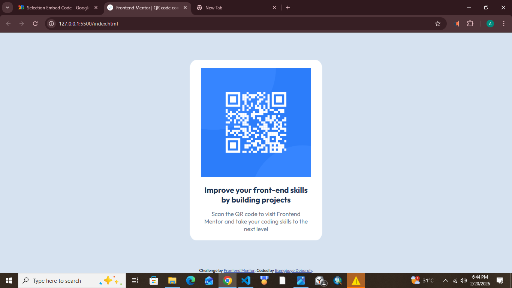

# Frontend Mentor - QR code component solution

This is a solution to the [QR code component challenge on Frontend Mentor](https://www.frontendmentor.io/challenges/qr-code-component-iux_sIO_H). Frontend Mentor challenges help you improve your coding skills by building realistic projects. 

## Table of contents

- [Overview](#overview)
  - [Screenshot](#screenshot)
  - [Links](#links)
- [My process](#my-process)
  - [Built with](#built-with)
  - [What I learned](#what-i-learned)
  - [Continued development](#continued-development)
- [Author](#author)


## Overview

### Screenshot




### Links

- Solution URL: [Github repo](https://github.com/Deborah-Bamgboye/qr-code-component-main)
- Live Site URL: [live site](https://deborah-bamgboye.github.io/qr-code-component-main/index.html)

## My process

### Built with

- Semantic HTML5 markup
- Flexbox
- CSS Grid
- media queries
### What I learned

I learnt mobile responsive design and made use of rem values. simply changed the root font-size


```css
@media (max-width: 400px) {
    html{
        font-size: 50%;
    }
}
.qr-text h3{
  font-size: 2rem;
}
```
I also learnt how to properly use css grid.Had a lot of struggles with it and almost gave up. mostly used justify-content and gaps
```css
.qr-image-container{
    display: grid;
    justify-content: center;
}
```


### Continued development

Will be sure to develop on css-variables .


## Author

- Frontend Mentor - [@yourusername](https://www.frontendmentor.io/profile/Deborah-Bamgboye)
- Github - [Deborah-Bamgboye](http://github.com/Deborah-Bamgboye/)

